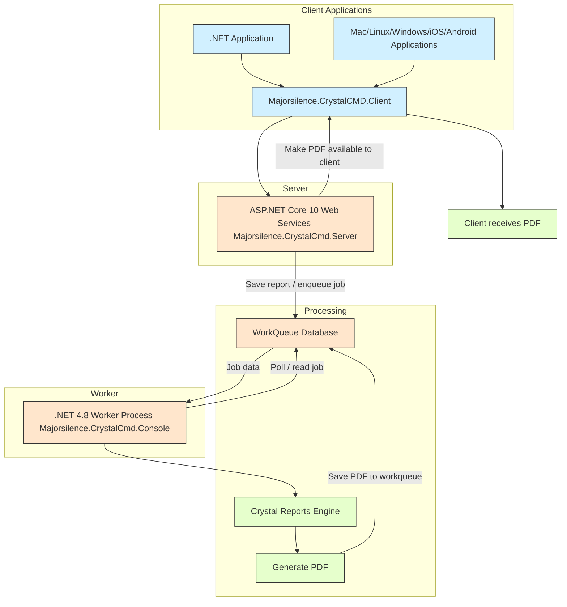

If you are looking for a production crystal reports server look into [SAP Crystal Server](https://www.sap.com/canada/products/technology-platform/crystal-server.html).

# What is CrystalCmd

**CrystalCMD** is a C#/dotnet and Java program that loads JSON files into Crystal Reports to produce PDFs. Initially an experimental proof of concept, it demonstrates generating Crystal Reports on Linux using Java and .NET framework (wine).

The main focus is the c#/dotnet implementation running within Windows/IIS and Linux/Wine.

**Key Features:**

- PDF Generation: Converts JSON (with embedded csv) data into PDF reports with Crystal Reports templates.
- Command Line & Server Modes: Supports both modes; server mode is recommended for better performance.
- Cross-Platform: Works on Linux and can run .NET implementations using Wine.

# Use cases
- Provide a path for porting a asp.net framework site from windows and iis to asp.net dotnet core net6.0 or newer on linux
- Provide support for developers to work on projects that use dotnet crystal reports while using a mac
- Provide a way to fence off legacy crystal reports behind a web api

# Development
CrystalCMD is developed with the following work flow:

* Nothing happens for months/years
* Someone needs it to do something it doesn't already do
* That person implements that something and submits a pull request
* Repeat if it doesn't have a feature that you want it to have, add it
    * If it has a bug you need fixed, fix it

# Git history rewrite (June 2026)

The git history was rewritten with `git filter-repo` to remove the SAP Crystal Reports
runtime jars (and an old committed build artifact) from **all** commits. They were removed
because the SAP Crystal runtime is proprietary and must not be redistributed in source
control, and because the binaries bloated the repository (the `.git` directory shrank from
~165 MB to ~2 MB).

Consequences:

* **Every commit SHA before the rewrite changed.** If you have an older clone, re-clone or
  hard-reset to the rewritten history — old branches reference commits that no longer exist.
* `java/CrystalCmd/lib/` no longer contains the jars. Reconstruct it before building with
  `scripts/download-crystal-libs.sh` (or `.ps1` on Windows) — see `java/CrystalCmd/lib/README.md`.

# Example usage

Note that, when using the command line option, this is very slow and highly recommended to use the server option.

test server: c.majorsilence.com

- https://c.majorsilence.com/status
- https://c.majorsilence.com/export

Example running from base CrystalCmd folder.

```bash
curl https://c.majorsilence.com/status

curl -u "username:password" -F "reportdata=@test.json" -F "reporttemplate=@the_dataset_report.rpt" https://c.majorsilence.com/export --output testout.pdf

# test localhost
curl -u "username:password" -F "reportdata=@test.json" -F "reporttemplate=@the_dataset_report.rpt" http://127.0.0.1:4321/export --output testout.pdf
```

## Server mode


1. http://localhost:4321/status
1. http://localhost:4321/export
   - Returns pdf as bytestream
   - Must be passed two post variables as byte arrays
     - reporttemplate
     - reportdata

# Security

CrystalCmd renders **whatever Crystal Reports template (`.rpt`) the caller uploads**. That
is by design, but it has important security consequences, because a `.rpt` can embed its own
database connections, SQL command objects, and references to external/UNC resources. Treat
the rendering service as something that runs **untrusted report definitions** and harden the
deployment accordingly.

## Treat the server/worker as untrusted-code execution

A malicious or compromised client can submit a template that tries to:

- connect to arbitrary databases or hosts reachable from the worker (SSRF / use of any
  ambient credentials),
- reference a UNC path (`\\attacker\share\...`) to make a Windows worker authenticate
  outbound over SMB and leak NetNTLM hashes,
- abuse `RecordSelectionFormula` / formula fields (Crystal formula injection).

Because any `.rpt` must be accepted, mitigate at the deployment boundary:

- Run the worker as a **low-privilege account**.
- Place it in an **isolated network segment** with an **egress firewall** that denies
  outbound traffic except to data sources you explicitly allow. **Block outbound SMB
  (445/139).**
- Only expose the API to trusted callers (authenticated, ideally also network-restricted).
- Where you control the report set, prefer an allow-list of known-good templates over
  accepting arbitrary uploads.

## Authentication and transport

- **Basic auth** credentials come from `Credentials:Username` / `Credentials:Password`.
  They ship **empty** — the server rejects all requests until you set them. The server
  **refuses to start** if they are set to the well-known defaults `user`/`password` (set
  `Security:AllowDefaultCredentials=true` only for local testing).
- **JWT** is enabled only when `Jwt:Key` is a real secret of **at least 32 bytes**; the
  shipped placeholder is ignored so it cannot be used to forge tokens. Use a unique secret.
- Basic credentials and bearer tokens are sent on every request. **Always use TLS.** Set
  `Security:RequireHttps=true` to force HSTS + HTTPS redirect when the server is exposed
  directly, or terminate TLS at a trusted reverse proxy (the server honours
  `X-Forwarded-Proto`/`X-Forwarded-For`).

## Polling handles

The id returned by `POST /export/poll` and `POST /analyzer/poll` is an opaque handle. When
a signing key is configured (`Security:PollTokenKey`, falling back to `Jwt:Key`) the handle
is bound to the authenticated caller via HMAC, so one principal cannot fetch another's
report by guessing/replaying the id. Set `Security:PollTokenKey` to a shared secret across
all instances in a multi-instance JWT deployment.

## Resource limits

- `Limits:MaxRequestBodyBytes` (default 100 MB) caps a single request body.
- GZip request bodies are decompressed with a hard cap (200 MB) to prevent decompression
  bombs.

## Java server

The reference Java server requires Basic auth on `/export`, reading expected credentials
from the `CRYSTALCMD_USERNAME` / `CRYSTALCMD_PASSWORD` environment variables (it rejects all
requests when they are unset). It is still a proof of concept — keep it behind an
authenticating, TLS-terminating reverse proxy and do not expose it directly.

# Postman Collection

[Majorsilence.CrystalCMD.postman_collection.json](Majorsilence.CrystalCMD.postman_collection.json)

# Dotnet

Use this project to generate test data from c# program

See [Crystal Reports, Developer for Visual Studio Downloads](https://help.sap.com/docs/SUPPORT_CONTENT/crystalreports/3354091173.html).

- Download the Crystal Reports .net runtime from: [https://origin.softwaredownloads.sap.com/public/site/index.html](https://origin.softwaredownloads.sap.com/public/site/index.html)
  - CR for Visual Studio SP35 CR Runtime 64-bit
  - CR for Visual Studio SP35 CR Runtime 32-bit

- Majorsilence.CrystalCmd.NetframeworkConsoleServer
    - a net48 embedio based console app/webserver
    - can be run on Linux using wine


See the [dotnet/Readme.md](https://github.com/majorsilence/CrystalCmd/tree/main/dotnet) file for more info..




# Alternative backend (preview)

CrystalCmd can render with [Majorsilence.Crystal](https://github.com/majorsilence/majorsilence.crystal)
instead of the SAP Crystal Reports runtime. Majorsilence.Crystal reads `.rpt` templates
itself and renders them with [Majorsilence Reporting](https://github.com/majorsilence/Reporting).
It runs in its own worker, `Majorsilence.CrystalCmd.RptEngineWorker`, which needs .NET 10
and nothing else: no SAP runtime and no Wine, on Windows or Linux.

It is opt-in. A deployment that changes nothing keeps rendering every request with Crystal.

## How it fits

Both workers read the same work-queue database. The server puts each request on one of two
pairs of channels: `crystal-reports` and `crystal-analyzer` for the Crystal worker, or
`rptengine-reports` and `rptengine-analyzer` for the new one. The endpoints and the request
format stay the same, apart from one optional field.

## Which backend renders a request

Three inputs decide, in this order:

1. **The request's own `Backend` field**: `Crystal`, `RptEngine` or `Auto`. In JSON it is
   `"Backend": "Auto"`; with the .NET client, `data.Backend = RenderBackend.Auto`.
2. **The server's default**, the setting `Routing:DefaultBackend` (environment variable
   `Routing__DefaultBackend`). It takes the same three values and is `Crystal` when unset.
3. **For `Auto`, the serviceable rule.** The server parses the template when the request
   arrives and sends it to the new worker only if the rule accepts it. Anything else goes
   to the Crystal worker.

A request that asks for `RptEngine` and fails the rule is refused with HTTP 400, naming every
reason. It is never rendered wrong or sent somewhere else. Analysis requests (`/analyzer`)
are routed the same way, on the template alone. The server logs each routing decision and
its reason.

## The serviceable rule

The new worker takes a request only when all of these hold:

- The request carries at most one table, and the template reads at most one.
- The same holds for each subreport: the request pushes it at most one table, and it reads
  at most one.
- The report has no cross-tab and no chart, including inside subreports.
- The export type is `PDF`, `CSV`, `Excel`, `ExcelDataOnly` or `RichText`.
- The template parses.

## What differs from the Crystal worker

- **Excel is `.xlsx`**, for both `Excel` and `ExcelDataOnly`. The Crystal runtime writes `.xls`.
- **No `CrystalReport`, `TEXT` or `WordDoc` export.** `CrystalReport` returns the template
  itself, and the others have no equivalent. `RichText` is the nearest to `WordDoc`, and
  Word opens it.
- **Data is pushed only.** The engine never opens the database connection a template
  names. It renders from the tables in the request, and a template given none renders with
  no rows.
- **One sort field.** `SortByField` applies its first entry, since the report has one
  primary sort. The worker logs a warning for the rest.
- **Fonts.** On Linux, Arial, Times New Roman and Courier New are drawn in the
  metric-compatible Liberation fonts. Text wraps and paginates as with the Microsoft
  fonts, but the glyphs differ. [dotnet/docker/Readme.md](dotnet/docker/Readme.md) has the
  measurement.
- **Culture.** Dates and numbers format in the worker's culture, as they do in Crystal.
  Run it in the culture of the Crystal host, with `LANG` on Linux.
- **Paper.** A template that prints on its printer's default paper is laid out on the page
  it was designed on, where Crystal uses the printer's paper.

**Fidelity is measured, not guaranteed.** The acceptance tests render CrystalCmd's sample
scenarios through both workers and compare the pages:

```bash
dotnet test dotnet/Majorsilence.CrystalCmd.NetFrameworkServer/Majorsilence.CrystalCmd.ClientTests -f net10.0 --filter Category=Acceptance
```

Each scenario's recorded agreement is in `AcceptanceTests.cs`, with what keeps it there.
Try your own templates with `Backend` set on a few requests before changing the default.

## Deploying it

1. **Get the worker.** Use the container image
   (`dotnet/docker/Dockerfile.crystalcmd.rptengine.workeronly`; see
   [dotnet/docker/Readme.md](dotnet/docker/Readme.md)) or the release zip for your
   platform, `Majorsilence.CrystalCmd.RptEngineWorker-win-x64-<version>.zip` or
   `-linux-x64-`. The zips need the .NET 10 runtime.
2. **Point it at the server's queue.** Use the same settings and database as the server,
   in `appsettings.json` or the environment: `WorkQueue__SqlType` (`sqlite`, `mssql` or
   `psql`) and `WorkQueue__SqlConnection`. `Worker__ReportsChannel` and
   `Worker__AnalyzerChannel` change its channels, which you should not need to do.
3. **Run it.** Use `dotnet Majorsilence.CrystalCmd.RptEngineWorker.dll`, or the `.exe` on
   Windows. Every minute it renders a bundled sample and logs `HealthCheckTask: IsHealthy = True`.
   After repeated failures it exits, so run it under something that restarts it: a service
   manager, systemd, or a container restart policy.
4. **Send requests to it.** Set `Backend` on a request, or set `Routing__DefaultBackend` on
   the server to `Auto` to send it everything it can serve. Keep the Crystal worker running
   for the rest, unless every request is known to pass the rule.

# Crystal report examples

https://wiki.scn.sap.com/wiki/display/BOBJ/Crystal+Reports+Java++SDK+Samples#CrystalReportsJavaSDKSamples-Database


# Java

Basic info on the java version.   

## command line mode

CrystalCmd upports running as a command line tool. Pass in path to report, data, and output fileand a pdf is generated.

```bash
java -jar CrystalCmd.jar -reportpath "/path/to/report.rpt" -datafile "/path/to/data.json" -outpath "/path/to/generated/file.pdf"
```

example 2

```bash
java -jar CrystalCmd.jar -reportpath "/home/peter/Projects/CrystalCmd/the_dataset_report.rpt" -datafile "/home/peter/Projects/CrystalCmd/test.json" -outpath "/home/peter/Projects/CrystalCmd/java/CrystalCmd/build/output.pdf"
```


## Run the server

CrystalCmd supports running in server mode. If you run it with no command line arguments it
starts a web server listening on port 4321. There are two end points that can be called.


```bash
java -jar CrystalCmd.jar
```

Call the server.

```bash
curl -u "username:password" -F "reporttemplate=@the_dataset_report.rpt" -F "reportdata=@test.json" http://localhost:4321/export > myoutputfile.pdf
```

### Example using docker

```bash
docker run -p 2005:4321 -t majorsilence/crystalcmd
```

Or run it as a daemon.

```bash
docker run -p 2005:4321 -d majorsilence/crystalcmd
```

Now check the status in your browser:

- http://localhost:2005/status

### Example of using the installed snap

install

```bash
snap install ./java/CrystalCmd/build/CrystalCmd.snap --force-dangerous --classic
```

run

```bash
crystalcmd -reportpath "/home/peter/Projects/CrystalWrapper/the_dataset_report.rpt" -datafile "/home/peter/Projects/CrystalWrapper/test.json" -outpath "/home/peter/Projects/CrystalWrapper/Java/build/output.pdf"
```

# Building Snaps

```bash
sudo ./build_snap.sh
```

## dev setup

```bash
sudo apt-get install openjdk-11-jdk
```

### Eclipse

Download [eclipse java edition](http://www.eclipse.org/downloads/eclipse-packages/).

Setup eclipse with [crystal references](https://archive.sap.com/documents/docs/DOC-29757).

Import java/CrystalCmd folder as ecplise project (Eclipse -> File -> Open Projects from File System).

### IntelliJ

Download [intelliJ community edition](https://www.jetbrains.com/idea/).

## Runtime setup

```bash
sudo apt-get install openjdk-11-jre
```

## Export Jar

- Eclipse -> File -> Export -> Java -> Runnable Jar File

Package required libraries into generated JAR

output as "CrystalCmd.jar" in folder ./CrystalCmd/java/CrystalCmd/build

# Crystal reports Eclipse JAR library downloads

https://origin.softwaredownloads.sap.com/public/site/index.html

# OpenJDK PDF Export Problem, fonts

https://answers.sap.com/questions/676449/nullpointerexception-in-opentypefontmanager.html?childToView=708783&answerPublished=true#answer-708783

> After some experimentation, a workaround was to create the fonts folder in the AdoptOpenJDK JRE (jre\lib\fonts) and copy a single font file from the **Linux msttcorefonts** mentioned above into the newly created fonts folder. My document uses all Arial font, but it doesn't seem to matter what font file is in the fonts folder. I copied Webdings.ttf. The file does have to be a real font file. I tried making a dummy text file and rename it to Webdings.ttf, but the NPE occurred with the dummy font file.
>
> Once a real font is copied to jre\lib\fonts, The PDF is created just fine with the Arial font embedded. It seems that there just has to be a one real font at jre\lib\fonts to get started, and then crjava/AdoptOpenJDK will eventually use fontconfig to find the correct Windows font.

Copy a file from

## Windows Example:

Copy a file to **C:\Users\[UserName]\.jdks\openjdk-16.0.1\lib\fonts** from **C:\Windows\Fonts**.

## Mac Example

copy '/System/Library/Fonts' into '/Users/[UserName]]/Library/Java/JavaVirtualMachines/[JavaVersion]/Contents/Home/lib/fonts'

## Linux Example:

```bash
# try the ubuntu or fedora way first
# https://answers.sap.com/questions/676449/nullpointerexception-in-opentypefontmanager.html
apk add --no-cache msttcorefonts-installer && update-ms-fonts && fc-cache -f && ln -s /usr/share/fonts/truetype/msttcorefonts /usr/lib/jvm/default-jvm/jre/lib/fonts
```

# ubuntu

```bash
apt install fonts-dejavu fontconfig msttcorefonts-installer && update-ms-fonts && fc-cache -f
ln -s /usr/share/fonts/truetype/msttcorefonts /usr/lib/jvm/java-1.11.0-openjdk-amd64/lib/fonts
```

# fedora

dnf install fontconfig dejavu-sans-fonts dejavu-serif-fonts


# Alternatives

- [CrystalReportsRunner](https://github.com/gerardo-lijs/CrystalReportsRunner)
- [SAP Crystal Server](https://www.sap.com/canada/products/technology-platform/crystal-server.html)
- [RptToXml](https://github.com/ajryan/RptToXml)

